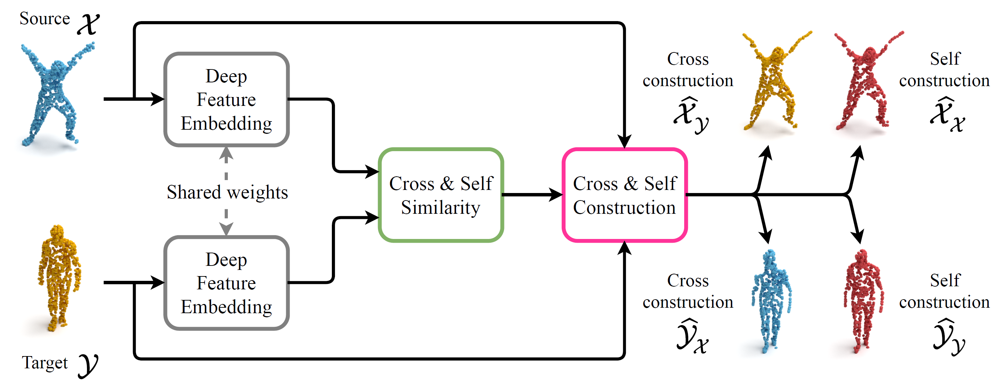
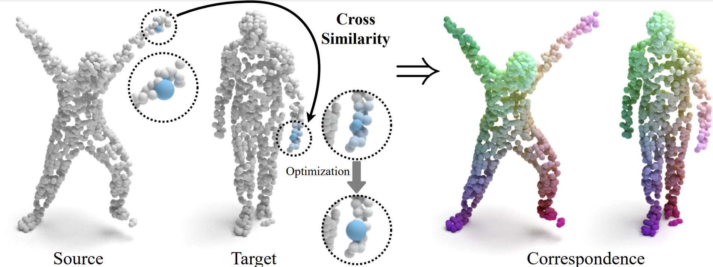
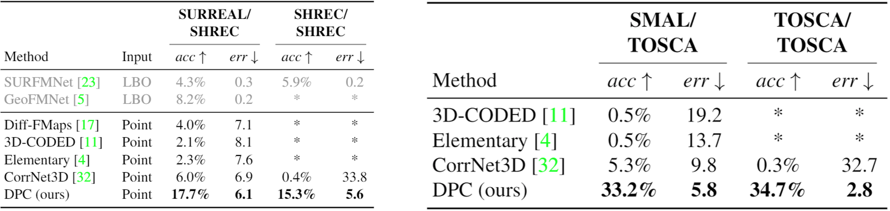

# DPC: Unsupervised Deep Point Correspondence via Cross and Self Construction (3DV 2021)

[[Paper]](https://arxiv.org/abs/2110.08636) [[Introduction Video (2 minutes)]](https://slideslive.com/38972252/dpc-unsupervised-deep-point-correspondence-via-cross-and-self-construction) [[Introduction Slides]](./data/docs/introduction_slides.pdf) [[Full Video (10 minutes)]](https://slideslive.com/38972393/dpc-unsupervised-deep-point-correspondence-via-cross-and-self-construction) [[Full Slides]](./data//docs/full_slides.pdf) [[Poster]](./data/docs/poster.pdf)

This repo is the implementation of [**DPC**](https://arxiv.org/abs/2110.08636). 

[](https://paperswithcode.com/sota/3d-dense-shape-correspondence-on-shrec-19?p=dpc-unsupervised-deep-point-correspondence)


&nbsp;


&nbsp;



## Tested environment
- Python 3.6
- PyTorch 1.6
- CUDA 10.2

Lower CUDA and PyTorch versions should work as well.

&nbsp;
## Contents
- [Installation](#installation)
- [Datasets](#datasets)
- [Train](#training)
- [Inference](#inference)
- [Cite](#citing-&-authors)

&nbsp;
# Installation
Please follow `installation.sh` or simply run
```
bash installation.sh 
```
&nbsp;

# Datasets
The method was evaluated on:
* SURREAL
  * 230k shapes (DPC uses the first 2k).
  * [Dataset website](https://www.di.ens.fr/willow/research/surreal/data/)
  * This code downloads and preprocesses SURREAL automatically.

* SHREC’19
  * 44 Human scans.
  * [Dataset website](http://3dor2019.ge.imati.cnr.it/shrec-2019/)
  * This code downloads and preprocesses SURREAL automatically.

* SMAL
  * 10000 animal models (2000 models per animal, 5 animals).
  * [Dataset website](https://smal.is.tue.mpg.de/)
  * Due to licencing concerns, you should register to [SMAL](https://smal.is.tue.mpg.de/) and download the dataset.
  * You should follow data/generate_smal.md after downloading the dataset.
  * To ease the usage of this benchmark, the processed dataset can be downloaded from [here](https://mailtauacil-my.sharepoint.com/:f:/g/personal/dvirginzburg_mail_tau_ac_il/Ekm37j0fi71Fn305v9nmXHABCSc1mWFa17uAc2jOngcyTQ?e=Ns2InB). Please extract and put under `data/datasets/smal`

* TOSCA
  * 41 Animal figures.
  * [Dataset website](http://tosca.cs.technion.ac.il/book/resources_data.html)
  * This code downloads and preprocesses TOSCA automatically.
  * To ease the usage of this benchmark, the processed dataset can be downloaded from [here](https://mailtauacil-my.sharepoint.com/:f:/g/personal/dvirginzburg_mail_tau_ac_il/EoMgplq-XqlGpl6K6lW6C8gBCxfq2gWXQ4f94xchF3dc9g?e=USid0X). Please extract and put under `data/datasets/tosca`

&nbsp;
# Training

For training run
``` 
python train_point_corr.py --dataset_name <surreal/tosca/shrec/smal>
```
The code is based on [PyTorch-Lightning](https://pytorch-lightning.readthedocs.io/en/latest/), all PL [hyperparameters](https://pytorch-lightning.readthedocs.io/en/latest/common/trainer.html) are supported. 
(`limit_train/val/test_batches, check_val_every_n_epoch` etc.)

&nbsp;
## Tensorboard support
All metrics are being logged automatically and stored in
```
output/shape_corr/DeepPointCorr/arch_DeepPointCorr/dataset_name_<name>/run_<num>
```
Run `tesnroboard --logdir=<path>` to see the the logs.

Example of tensorboard output:


&nbsp;

# Inference
For testing, simply add `--do_train false` flag, followed by `--resume_from_checkpoint` with the relevant checkpoint.

```
python train_point_corr.py --do_train false  --resume_from_checkpoint <path>
```
Test phase visualizes each sample, for faster inference pass `--show_vis false`.

We provide a trained checkpoint repreducing the results provided in the paper, to test and visualize the model run
``` 
python train_point_corr.py --show_vis --do_train false --resume_from_checkpoint data/ckpts/surreal_ckpt.ckpt
```



&nbsp;
# Citing & Authors
If you find this repository helpful feel free to cite our publication -

```
@InProceedings{lang2021dpc,
  author = {Lang, Itai and Ginzburg, Dvir and Avidan, Shai and Raviv, Dan},
  title = {{DPC: Unsupervised Deep Point Correspondence via Cross and Self Construction}},
  booktitle = {Proceedings of the International Conference on 3D Vision (3DV)},
  pages = {1442--1451},
  year = {2021}
}
```

Contact: [Dvir Ginzburg](mailto:dvirginz@gmail.com), [Itai Lang](mailto:itai.lang83@gmail.com).
